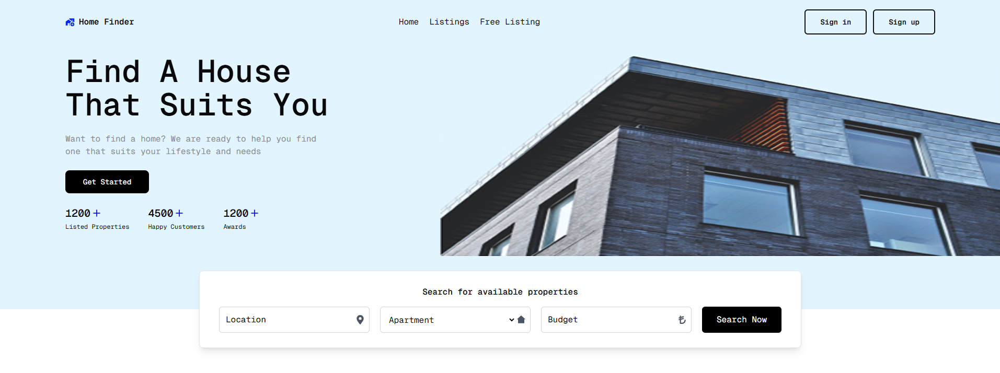

# Real Estate Management Application

This project is a real estate management application where users can list, update, delete, and add properties to their favorites. Users can also sign up and log in, but they must confirm their account via a verification code sent to them upon registration.

## Technologies Used
- **Backend**: Java Spring Boot
- **Frontend**: Next.js, Tailwind CSS
- **Database**: PostgreSQL
- **Elasticsearch**: For filtering and sorting properties
- **Amazon S3**: For storing property images
- **Flyway**: For database migrations
- **Spring Security**: For authentication and security

## Features
- User registration and login with email verification
- Listing, updating, deleting, and favoriting properties
- Advanced search and sorting with Elasticsearch (by creation date and price)
- Property image uploads via Amazon S3
- Database migrations using Flyway
- Security implementation using Spring Security

## Setup
To run the project locally, follow these steps:

1. **Backend (Spring Boot)**:  
   - Update the database connection details in `src/main/resources/application.properties` with your PostgreSQL database credentials.
   - Start the Spring Boot application.

2. **Frontend (Next.js)**:  
   - Install the necessary dependencies by running `npm install`.
   - Start the application with `npm run dev`.

3. **Database Migrations**:  
   - Apply the database migrations using Flyway.

